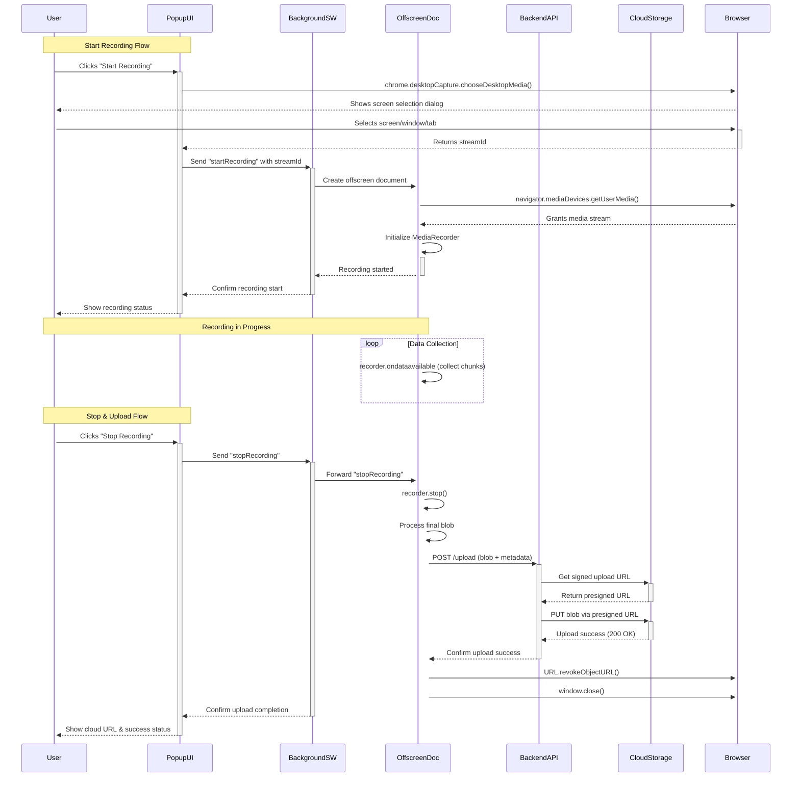
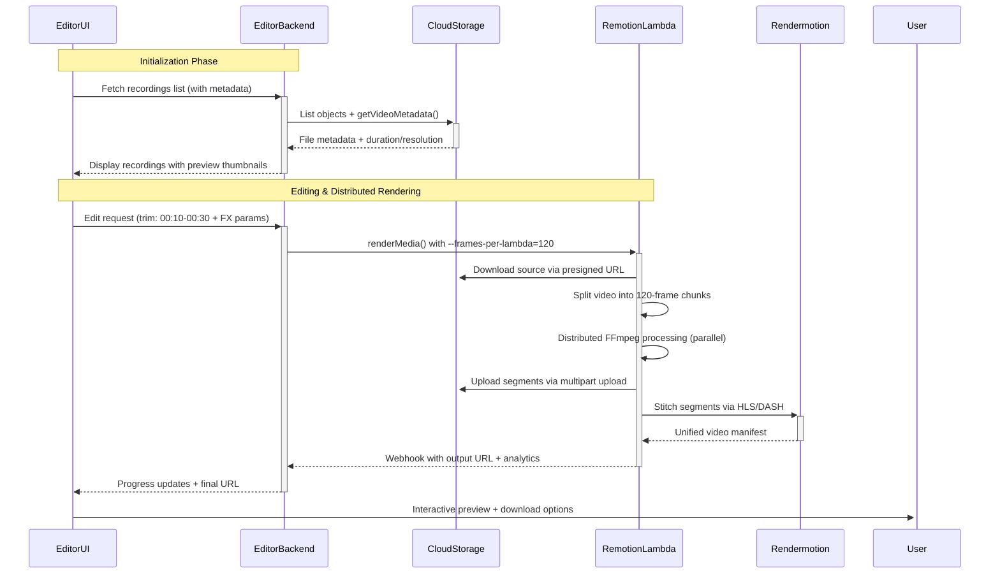

# DemoDojo

## Project Overview
DemoDojo is a  screen recording tool and video editor that enables users to create professional-quality screen recordings with automatic zooms and pans. It consists of two main components:
1. **Browser Extension**: For recording screen activities with intelligent zoom capabilities.
2. **Video Editor**: For refining and exporting recordings with additional customization.

---

## Tech Stack
- **Frontend**: Next.js, TypeScript, TailwindCSS, Shadcn UI
- **Backend**: Python (Rust or Go in future), FastAPI, Remotion ()
- **Database**: Supabase (auth, database, and storage)
- **Browser Extension**: JavaScript/TypeScript with Manifest v3
- **Rendering**: Cloud Rendering with Remotion + RenderMotion

---

## High-Level Features

### 1. Browser Extension
#### Core Features
- Record the current tab or entire screen
- Automatic follow-cursor zooms and pans based on user actions
- Hide browser toolbars for a cleaner recording experience
- Countdown timer for screen sharing bar hiding
- Start/Stop recording directly from the pinned extension button

#### Bonus Features
- Real-time tooltips to guide the user
- Cross-browser compatibility: Chrome, Edge, Brave
- Supports macOS, Windows, and Linux

### 2. Video Editor
#### Core Features
- Import recordings or videos
- Add automatic and manual zooms
- Adjust zoom position, depth, and timing
- Trim, copy, and delete segments from the timeline
- Add/remove background images or colors

#### Additional Features
- Multi-aspect ratio exports (e.g., 16:9, 9:16, 1:1)
- Background blur and browser appearance customization
- Click animations with configurable styles
- Cloud rendering for faster rendering

---

### Cost saving focus
From long term perspective, we want to avoid paying for cloud rendering services. This occupies a lot of our budget.
- Using Remotion + Rendermotion incurs AWS Lambda fees (e.g., ~$0.15 for a 10-minute 720p video) plus infra costs. 
- For cheaper alternatives, open-source tools like Revideo (free, React-based) or MoviePy (Python-driven) offer programmatic video creation without licensing fees.
- We can pair these with Google Cloud Run functions for scalable, budget-friendly server-side rendering. This avoids Lambda’s per-render costs and suits high-volume workflows.

---

## Implementation

### Flow 1: Chrome Extension → Cloud Storage
Record screen → Upload to cloud storage (e.g., AWS S3, Google Cloud Storage, Supabase Storage etc.)

#### Sequence Diagram

### Flow 2: Cloud Video Editor → Cloud Rendering
Edit recordings in browser → Process via cloud compute. This flow targets using hybrid architecture - Remotion + RenderMotion

#### Sequence Diagram

